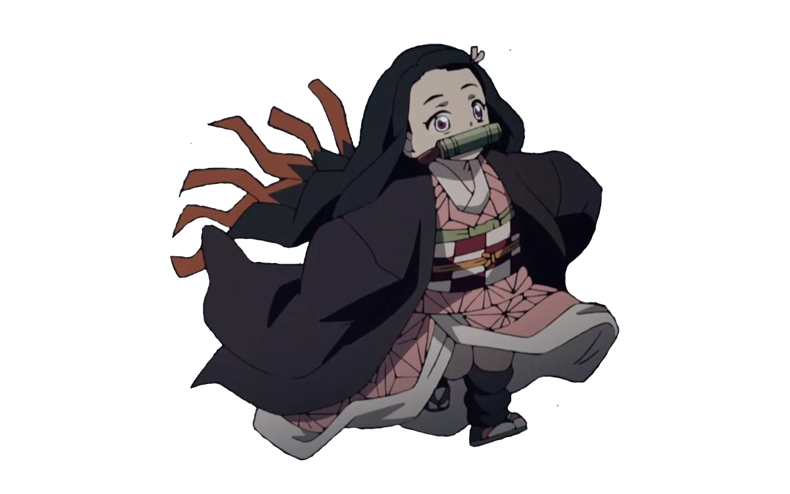

<h1 align="center">👋 𝘏𝘦𝘭𝘭𝘰! 𝘐’𝘮 𝘛𝘪𝘭𝘵</h1>

 
  
 
 
  
 
 <h2 align="center">🧑‍💻 About me</h2>
 I'm Software Engineer from Russia. 🇷🇺 
 I'm interested in game development, machine learning/artificial intelligence/deep learning, web. I hate 1C. ☠️ 
 At the same time, I read books, play video games and have fun. 

 

## 📌 Pinned

## [🖥 Projects](markdown/my_projects/main.md)
## [😈 Git Gists](https://gist.github.com/t1ltxz-gxd)
## [📋 Dev manuals](https://github.com/t1ltxz-gxd/Dev-manuals)
## [📀 .DotFiles](https://github.com/t1ltxz-gxd/.DotFiles)
## [🔓 OpenSource Soft](markdown/open_soft/main.md)

  
<h2><b>⭐GitHub stats</b></h2>

  

     
    
   
    
   
  

  
<h2><b>🚀My technology stack</b></h2>

  ⌨️ Programming languages:
  

   
  

 🧩 Code Editors & IDE:
 

 

 📁 Frameworks:
  

 

 🗃️ Databases:
 

 

 🎮 Game Engines:
  

 

 🐳 DevOps:
   

 

⚙️ Utility:
   

 

## 🍒 Recent Blog Posts

  

            

 

 

